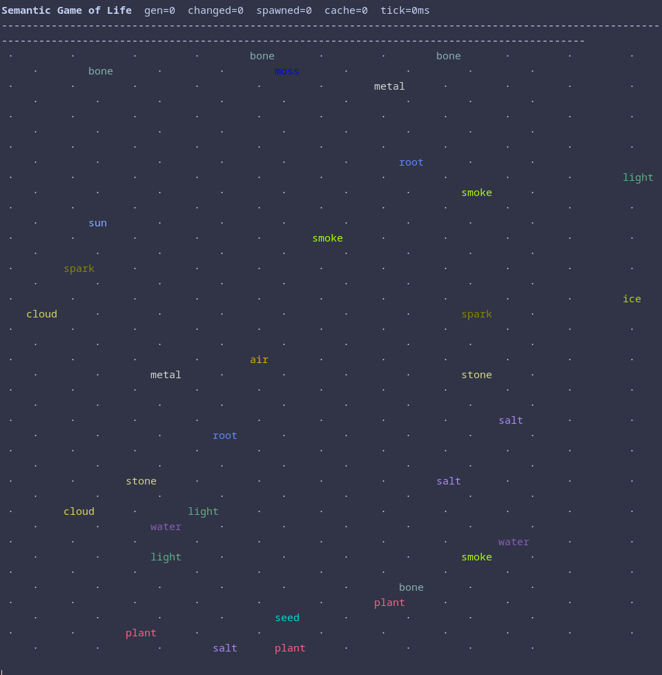
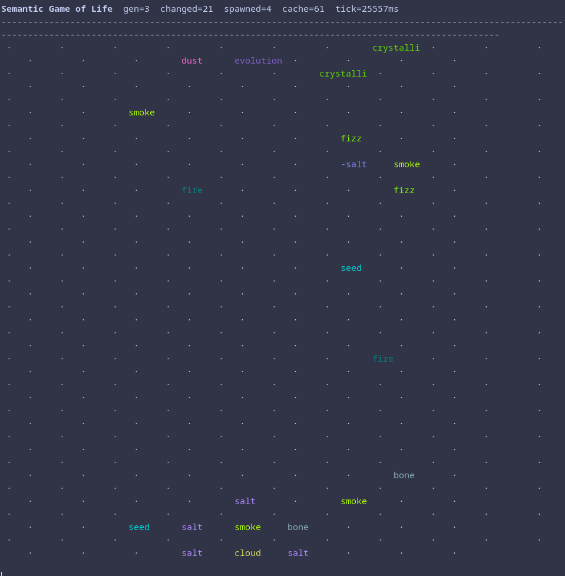
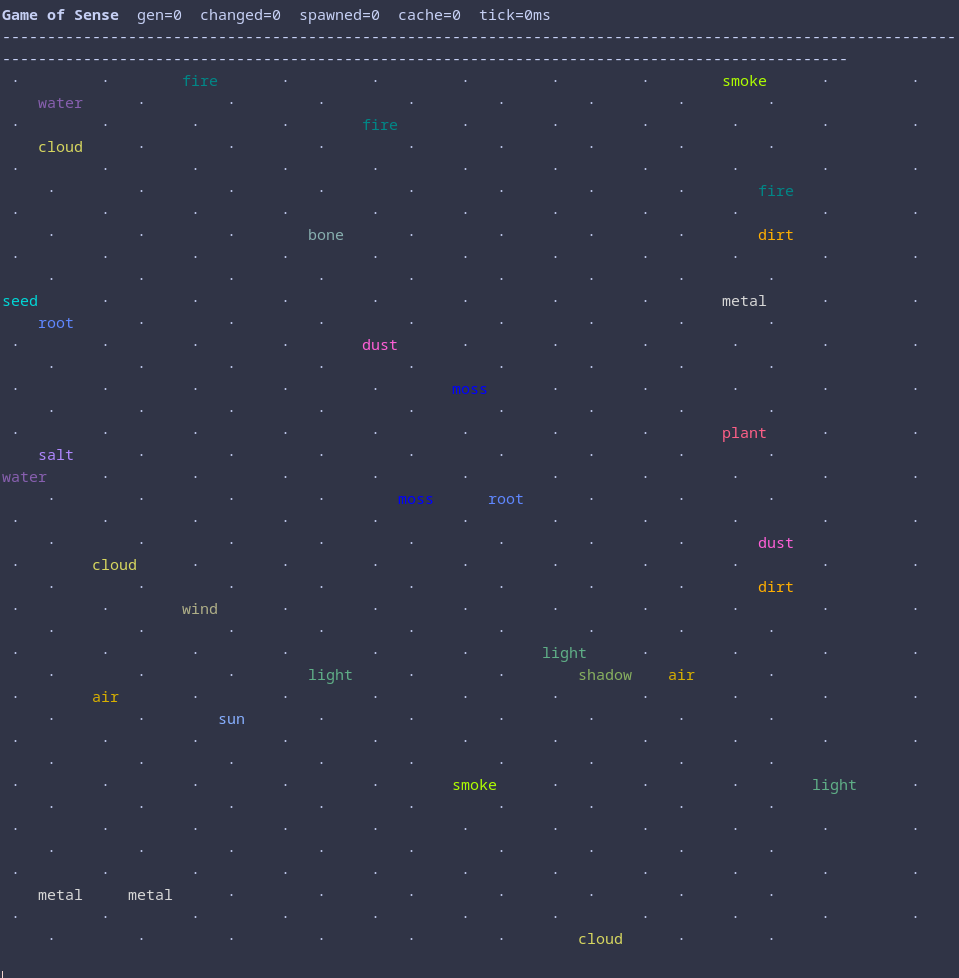

# Game of Sense

> Conway's Game of Life, but cells are **concepts** and the transition rule is a **local LLM**.

<p align="center">
  
  
  
</p>

An empty cell surrounded by `water`, `dirt`, and `sun` might become `plant`.
A `plant` engulfed by `fire` becomes `ash`. `stone` next to `metal` and
`air` crystallises into `crystal`. The board evolves into a slow, emergent
map of how ideas collide.

---

## What it does

Each generation, every active cell and its 8 Moore neighbors are sent to
a local Ollama model (`qwen3.5:2b`) which returns **one word** — the new
concept that emerges in that cell. Results are cached, so repeat
neighborhoods cost nothing after the first encounter.

To keep the board from collapsing into a handful of dominant attractors,
a few random seeds (`water`, `fire`, `salt`, `spark`, `shadow`, …) are
injected into empty cells each tick.

### Example emergent reactions observed in practice

| Neighborhood | Emerged |
|---|---|
| `fire` + `wood` + `air` | `ash` |
| `sun` + `fire` | `sunlight` |
| `stone` + `metal` + `air` | `crystal` |
| `water` + `fire` | `warmth` |
| `water` + `dirt` + `sun` | `plant` |

---

## Requirements

- Elixir **1.17+** (tested on 1.19 / OTP 27)
- [Ollama](https://ollama.com) running locally on `:11434`
- The `qwen3.5:2b` model pulled: `ollama pull qwen3.5:2b`
- **Parallelism** on the Ollama server — otherwise every call queues
  serially and one tick takes a minute:

  ```bash
  OLLAMA_NUM_PARALLEL=4 ollama serve
  ```

---

## Quick start

```bash
mix deps.get
mix compile

# Run 10 generations on a 20x20 board:
mix run -e 'LifeSemantic.CLI.run(10)'

# Run until Ctrl-C:
mix run -e 'LifeSemantic.CLI.run(:infinity)'
```

Each frame clears the terminal and repaints. The header shows:

```
Game of Sense  gen=3  changed=21  spawned=4  cache=87  tick=6120ms
```

- `gen` — generation number
- `changed` — cells whose concept changed this tick
- `spawned` — fresh seeds injected into empty cells
- `cache` — size of the `(cell, neighbors) -> concept` memo table
- `tick` — wall-clock time for this generation

Colors are stable per concept (same word always gets the same hue), so
you can visually track a concept spreading or dying out.

---

## How it works

### Transition rule

For each cell, we collect the Moore neighborhood (8 cells, toroidal
wrap) and ask Ollama:

```
system: Semantic Game of Life. Given a cell + 8 neighbors, output ONE
        lowercase word (the emergent concept) or - for empty.
prompt: cell=water neighbors=fire,sun,dirt,air,stone,wood,metal,seed ->
```

With `think: false` and `num_predict: 4` the model answers in ~1s. The
response is trimmed to a single lowercase word.

### Short-circuits (no LLM call needed)

- Non-empty cell with **0 non-empty neighbors** → dies (lonely).
- Empty cell with **fewer than 3 non-empty neighbors** → stays empty.

Otherwise we hit the cache or the LLM.

### Cache

`ETS` table keyed on `(current_concept, sorted_neighbors)`. Sorting the
neighbors means all 8 rotations/reflections of the same multiset
collapse to one entry — cache hit rates climb quickly as the board
stabilizes.

### Spawning

After each tick, `@spawn_per_tick` random empty cells get seeded with a
basic concept (`water`, `fire`, `spark`, `shadow`, …). Without this the
board degenerates within ~10 generations.

### Toroidal topology

Edges wrap. No boundary effects.

---


## Known behaviors

- **First generation is the slowest** — every neighborhood is a fresh
  cache miss. Watch `cache=` climb and `tick=` drop over subsequent
  generations.
- **Strong attractors emerge** — concepts like `ash` and `dust` tend to
  propagate. Spawning keeps the board from fully collapsing, but you'll
  still see large monoculture regions. That's the simulation, not a bug.
- **Model quirks leak through** — `qwen3.5:2b` sometimes returns
  conversational preamble; the stop tokens (`\n`, space, `,`, `.`) clip
  it to a single word. If a reply is empty, the cell keeps its current
  concept.
